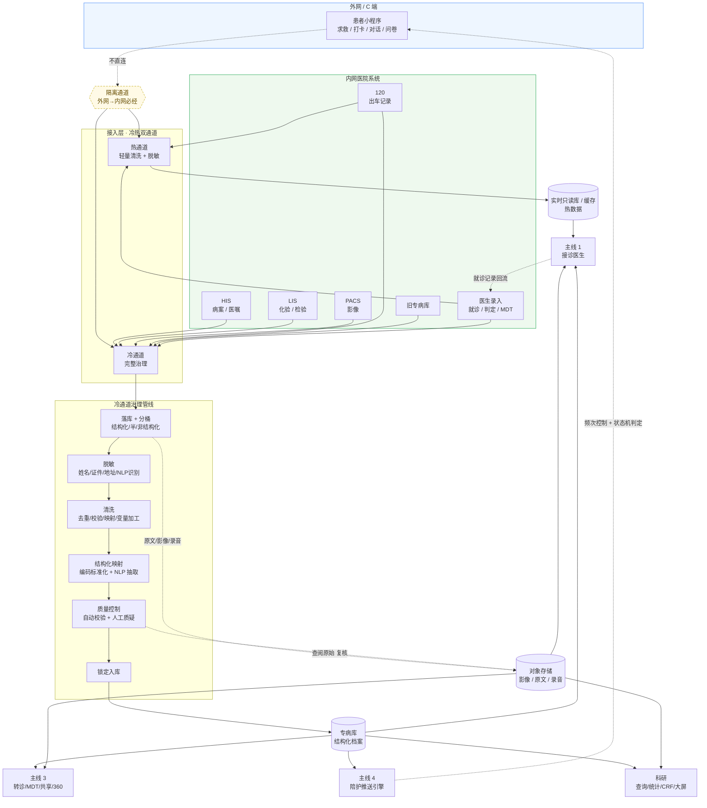

# 数据流贯穿图

> 这份文档把 4 条主线的数据关系串成**一张图**。原型阶段会做一个「数据流转大屏」页面（`P401`）来直接呈现它（**不做钻取交互**，只用作单页展示）。
>
> **v2 评审反馈已合并**（见末尾「修订记录」）。

---

## 一图总览

---

## 数据流的几条关键原则

### 1. 外网 / 内网必经隔离通道
C 端小程序在外网（公网），治理与专病库在内网。两者之间走专门的隔离通道（边界脱敏 + 防火墙 + 审计），**不允许 C 端直连内网**。原型在大屏页用**黄色虚线方框**表示这一边界。

### 2. 冷热双通道分流（Lambda/Kappa 思路）
- **热通道**：小程序求救、120 出车、医生录入这类**时效敏感**的数据，进轻量清洗 + 脱敏后写入实时只读库 / 缓存，供接诊医生秒级调阅
- **冷通道**：HIS/LIS/PACS、旧专病库这类**完整性敏感**的数据，跑完整治理（脱敏 → 清洗 → 映射 → 质控 → 锁定），最终入专病库

**实践含义**：原型阶段在 `P301 数据接入监控` 用两个 Tab 切换"热通道"和"冷通道"，让评审者看到两条路。

### 3. 脱敏前置于清洗
**评审修正**：原顺序"清洗 → 脱敏 → 映射 → 质控"调整为 **"脱敏 → 清洗 → 映射 → 质控"**。原因：
- 数据落库后**立刻脱敏**，确保后续治理流程接触的都是脱敏数据，降低泄漏面
- 清洗（去重/校验）不依赖明文身份信息，脱敏后仍能完成
- 对于需要查阅原文的环节（质控人工复核），通过 **D2 对象存储的查阅权限**单独走审计，而不是依赖整个管线的明文

### 4. D2 对象存储被接诊医生和质控同时消费
**评审修正**：原图遗漏了两条线，已补：
- `D2 → C1（接诊医生）`：让接诊医生能看到伤口照片、患者上传的录音、PACS 原图
- `D2 ↔ G6（质控）`：让质控人工质疑时能调阅原始病历原文 / 报告单截图来复核

### 5. 专病库仍是结构化数据的唯一对外层
消费侧（C1/C2/C3/C4）的**结构化档案**一律从 `D1 专病库` 读，不直连源系统。`DH` 实时只读库只承担"急救时序"场景。

### 6. 闭环回流必须加约束
**评审修正**：`C3 主线 4 推送 → S6 患者小程序` 这条回流容易触发死循环（推送 → 患者回复 → 再触发推送…），所以必须有：
- **Rate Limiting**：单患者单类型消息频次上限（如同一类知识推送 24 小时内 ≤1 次）
- **状态机判定**：随访任务有「未触发 → 已推送 → 已响应 → 已关闭」状态机，每个状态只能向下走
- **熔断**：极端异常时（推送速率突增）自动停推 + 告警

详见 `journey-4-care.md` 末尾「系统约束」。

---

## 4 条主线分别消费什么数据

### 主线 1（蛇伤急救）消费

| 数据 | 来自 | 用途 | 实时性 |
|---|---|---|---|
| 医院列表 + 血清库存 | 主数据 + 赛伦接口 | 求救时就近匹配 | 实时 |
| 患者既往史（结构化） | 专病库 D1 | 接诊前预览 | 实时（先走热通道 DH，事后合并 D1） |
| **患者实时上报（照片/录音）** | **D2 对象存储** | **接诊医生远程查看** | **实时** |
| 蛇种 / 治疗知识库 | 专病库 D1 | Agent 初诊建议依据 | 实时 |
| 当前就诊 | 主线 1 实时录入（写回 S7） | 自身工作流 | 实时 |

### 主线 2（数据治理）消费

主线 2 是生产者也是消费者：
- **生产**：把源数据治理成专病库
- **消费**：质控时调用接诊医生进行答疑（反向消费医生通讯录），并需要查阅 D2 原始资料做人工复核

### 主线 3（医生工作站）消费

| 数据 | 来自 | 用途 | 实时性 |
|---|---|---|---|
| 患者完整档案 | 专病库 D1 | 患者 360、转诊带资料、MDT 共享 | 实时 |
| 影像 / 病历原文 / 录音 | 对象存储 D2 | MDT 讨论时打开原图、共享时附原文 | 实时 |
| 医生通讯录 + 专科 | 系统管理 | MDT 邀请、转诊路由 | 实时 |
| Agent / 图像识别结果 | 算法 | 判定增强 | 实时 |

### 主线 4（患者陪护）消费

| 数据 | 来自 | 用途 | 实时性 |
|---|---|---|---|
| 出院记录 | 专病库 D1 | 触发随访计划 | 实时 |
| 患者标签 | 专病库 D1 | 个性化知识推送 | 实时 |
| 历史依从率 / 随访结果 | 专病库 D1 | 推送频率自适应 + 状态机判定 | 实时 |
| 当次对话/打卡/问卷 | 主线 4 实时录入（回流热通道） | 自身工作流 + 回流主线 2 | 实时 |

> **目前都按实时考虑**（评审约定）。后期某些消费（科研统计）若不行再降级到离线。

---

## 数据流转大屏（P401）呈现方式

**不做钻取交互**，单页直接呈现：

| 区域 | 内容 |
|---|---|
| 顶部 | 4 条主线缩略徽章 + 实时治理 QPS |
| 中部主图 | 上述 mermaid 的视觉化版本（用 SVG 或 ECharts Sankey） |
| 左侧栏 | 7 个源的实时入流量条 |
| 右侧栏 | 4 个消费侧的实时调用条 |
| 底部 | 网络边界水印 + 冷热双通道切换演示 |

评审者一眼就能看到整张数据地图，不需要交互。

---

## 修订记录（评审反馈合并）

| 反馈来源 | 修订 |
|---|---|
| 顺序颠倒 | 脱敏前置：现 `落库 → 脱敏 → 清洗 → 映射 → 质控 → 锁定` |
| C 端不能直连内网 | 新增 `EDGE 隔离通道`，外网→内网必经，黄色虚线方框 |
| 冷热分流（Lambda/Kappa） | 新增 `HOT 热通道` 和 `COLD 冷通道`，并新增 `DH 实时只读库` |
| C1 没消费 D2 | 新增 `D2 → C1` 连线（接诊医生看影像/原文/录音） |
| G6 看不到原始数据 | 新增 `G6 ↔ D2` 连线（质控人工复核可查 D2） |
| 推送可能死锁/轰炸 | 在 `C3 → S6` 连线加注 `频次控制 + 状态机判定`，详见 journey-4-care.md |
| 大屏交互 | 改为单页展示，**不做钻取**（原"钻取到模块"计划取消） |
