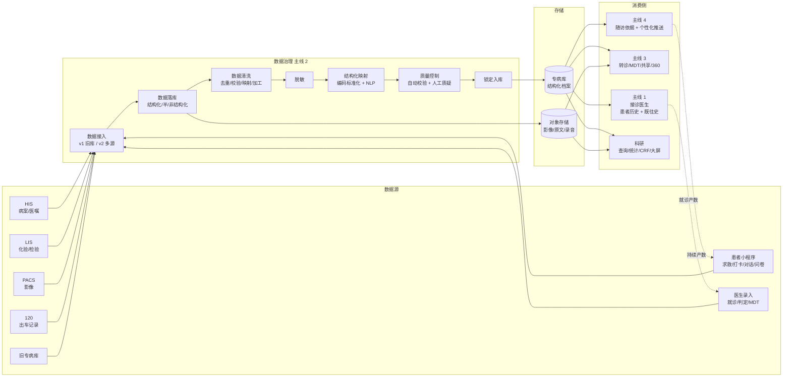

# 数据流贯穿图

> 这份文档把 4 条主线的数据关系串成**一张图**。原型阶段会做一个「数据流转大屏」页面（`J2-13`）来直接呈现它，让评审者看到"数据治理为什么是底座"。

---

## 一图总览

---

## 数据流的几条关键原则

1. **所有源数据都进治理管线**，不绕过。即使是 c 端患者上报，也要走清洗 + 脱敏 + 质控，避免脏数据污染专病库。
2. **专病库是唯一对外提供数据的层**。消费侧（主线 1/3/4 + 科研）一律从专病库读，不直连源系统。
3. **未治理数据可以临时供主线 1 使用**（急救场景对实时性要求高），但要标"未质控"水印，事后回流治理。
4. **闭环回流**：主线 4 的随访数据 / 主线 1 的就诊记录都会回到源（S6/S7），再次进入治理 → 形成飞轮。

---

## 4 条主线分别消费什么数据

### 主线 1（蛇伤急救）消费

| 数据 | 来自 | 用途 | 实时性要求 |
|---|---|---|---|
| 医院列表 + 血清库存 | 主数据 + 赛伦接口 | 求救时就近匹配 | 实时 |
| 患者既往史 | 专病库 | 接诊前预览 | 准实时（分钟级） |
| 蛇种 / 治疗知识库 | 专病库 | Agent 初诊建议依据 | 离线（日级更新） |
| 当前就诊 | 主线 1 实时录入 | 自身工作流 | 实时 |

### 主线 2（数据治理）消费

主线 2 是生产者也是消费者：
- **生产**：把源数据治理成专病库
- **消费**：质控时调用接诊医生进行答疑 → 反向消费医生通讯录

### 主线 3（医生工作站）消费

| 数据 | 来自 | 用途 | 实时性要求 |
|---|---|---|---|
| 患者完整档案 | 专病库 | 患者 360、转诊带资料、MDT 共享 | 实时 |
| 影像 / 病历原文 | 对象存储 | MDT 讨论时打开原图 | 实时 |
| 医生通讯录 + 专科 | 系统管理 | MDT 邀请、转诊路由 | 准实时 |
| Agent / 图像识别结果 | 算法 | 判定增强 | 实时 |

### 主线 4（患者陪护）消费

| 数据 | 来自 | 用途 | 实时性要求 |
|---|---|---|---|
| 出院记录 | 专病库 | 触发随访计划 | 准实时（小时级） |
| 患者标签 | 专病库 | 个性化知识推送 | 离线 |
| 历史依从率 / 随访结果 | 专病库 | 推送频率自适应 | 离线 |
| 当次对话/打卡/问卷 | 主线 4 实时录入 | 自身工作流 + 回流主线 2 | 实时 |

---

## 各数据"被看见"的页面

> 让评审者能点开「数据流转大屏」（`J2-13`）后，再钻取到具体页面感受治理的价值。

| 数据节点 | 大屏可视化 | 钻取到 |
|---|---|---|
| 源接入 | 7 个源的流量条 | `J2-01` 数据接入监控 |
| 落库分桶 | 结构化/半/非结构化占比 | `J2-03` 数据落库总览 |
| 清洗 | 清洗通过率漏斗 | `J2-04` 清洗任务列表 |
| 脱敏 | 脱敏命中字段 TopN | `J2-06` 脱敏规则管理 |
| 映射 | NLP 抽取置信度分布 | `J2-07` 映射工作台 |
| 质控 | 质疑/答疑/锁定 SLA | `J2-08` 质控工作台 |
| 消费 | 每个消费侧 QPS / 调用 TopN | 跳转到对应主线 |

---

## 评审检查清单

1. **闭环**：主线 4 → 源 → 治理 → 专病库 → 主线 4 这条飞轮有没有讲清楚？
2. **实时 vs 离线**：哪些场景必须实时（急救判定），哪些可以离线（科研分析）？
3. **未治理数据兜底**：急救场景"未质控"水印的策略合理吗？
4. **大屏的钻取深度**：要不要支持从大屏一路钻到单条记录？还是只到模块层？
5. **隔离**：内网外网混用问题（`人民蛇伤模块.md` 问题记录第 1 条）怎么在图里反映？要不要加一道"网络边界"虚线？
