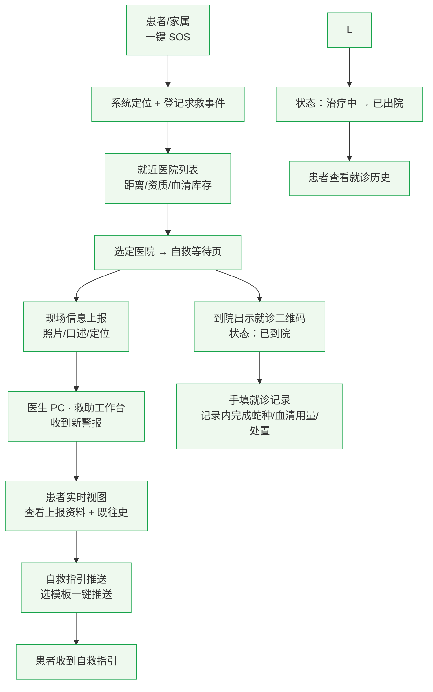
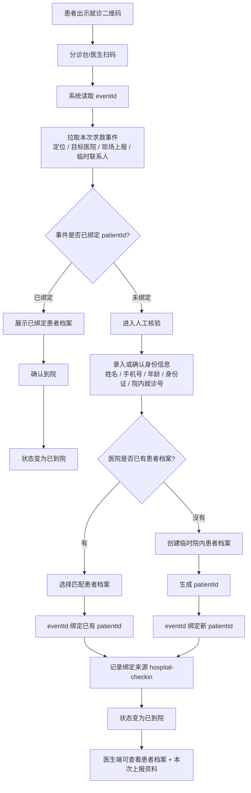
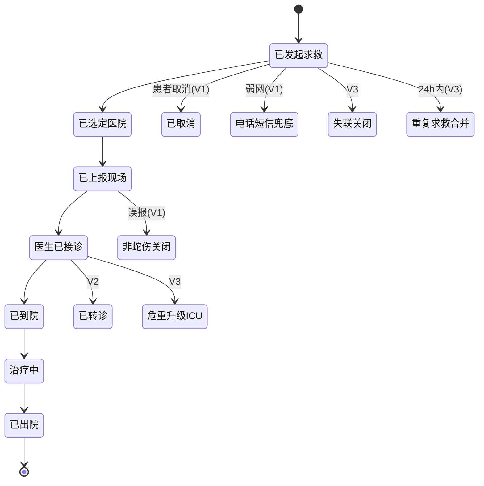
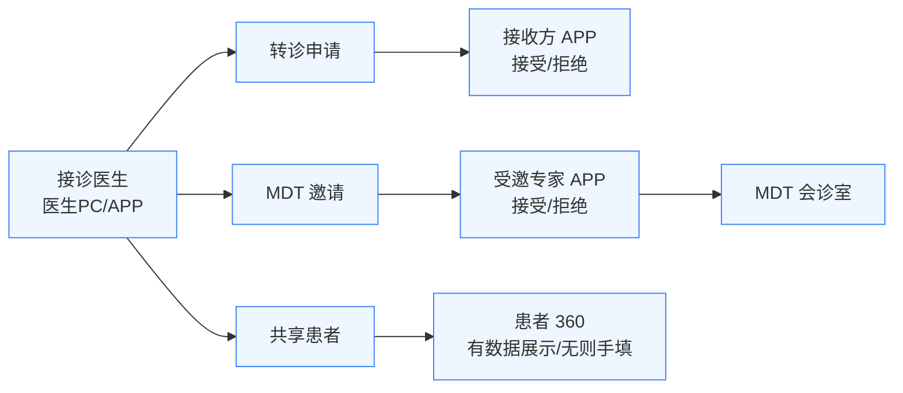
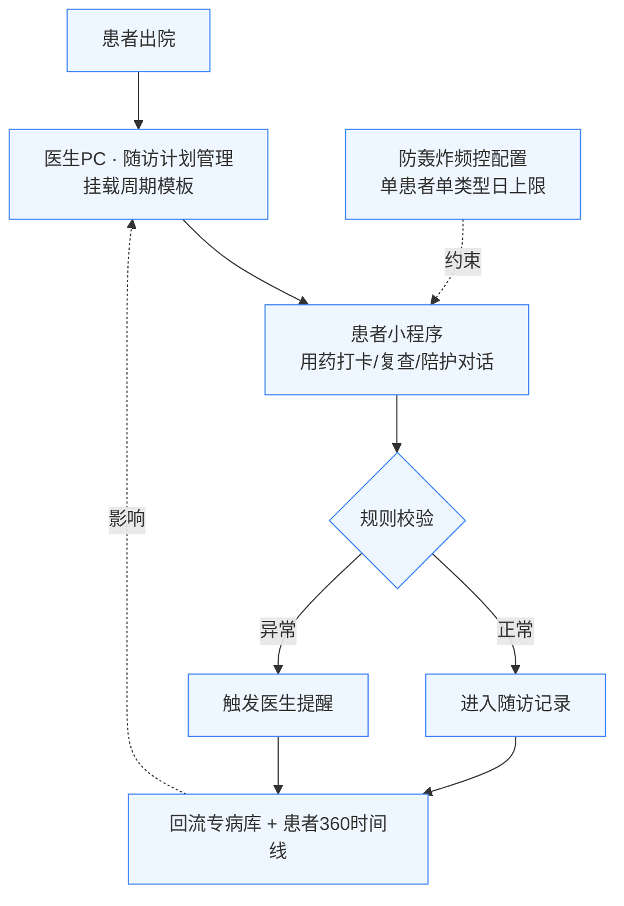
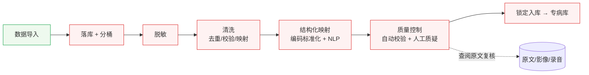
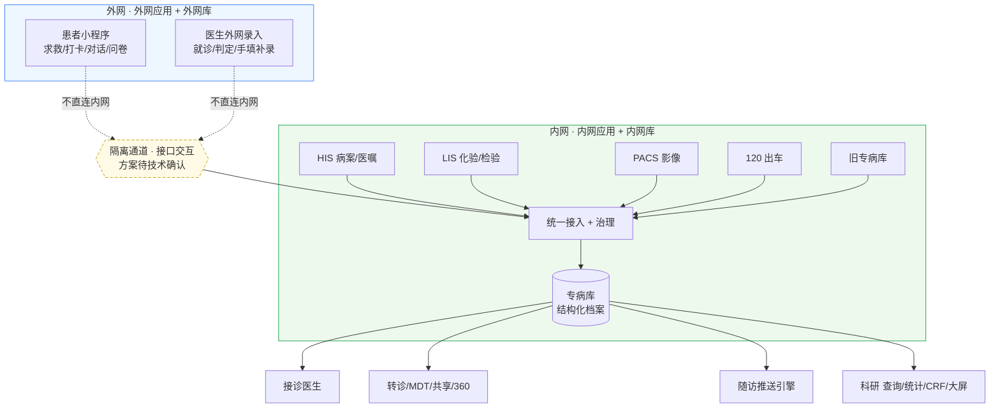

# 蛇伤专病平台 · 产品需求文档 PRD v1.2

> **本文档是蛇伤专病平台规划的唯一 source of truth。** 自 v1.1 起，仅维护本文档；下列旧文档不再维护，已归档至 `docs/_archive/`：
>
> - `docs/data-flow.md`（数据流贯穿图）
> - `docs/page-inventory.md`（页面清单）
> - `docs/information-architecture.md`（信息架构 & 左菜单）
> - `docs/roles.md`（角色 & 终端清单）
> - `docs/journeys/journey-1~4-*.md`（4 条主线 user journey）
>
> 根目录 `人民蛇伤模块.md` 仅作为早期模块脑图来源保留引用，不再维护。会议讨论记录见 `discuss/`。

---

## 1. 文档说明

| 项 | 内容 |
|---|---|
| 版本 | v1.2 |
| 定位 | 唯一规划口径（替代上述旧文档） |
| 适用阶段 | 原型评审 + 客户对齐；指导下一步出新原型图与代码改造 |
| 编写依据 | `人民蛇伤模块.md` + `docs/*` + 三轮 AI 评审（`discuss/`）+ 会议结论（`discuss/0603-用户答疑.md`） |

### 1.1 v1.1 相对早期规划的核心调整

1. **删除冷热双通道架构**，改为单一接口/同步通道，不追求秒级时效，降低复杂度。
2. **内外网拆成两个应用**：内网应用（库+应用，对接医院系统）+ 外网应用（库+应用）；应用间接口、边界隔离方案标为「待技术确认」。
3. **版本重新分层**：从「页面优先级标签」改为「能力成熟度」，消除「页面 v1 但依赖 v2/v3 底座」的倒挂。
4. **缺失医疗数据 → 手填补录**；脱敏仅做前端展示，后端保留复核能力，原型阶段不展开隐私边界。
5. **医生端 V1 仅做 PC**；医生 APP、转诊、MDT、共享、患者 360、患者陪护打卡等整体移 V2。

### 1.2 修订记录

| 版本 | 日期 | 变更 |
|---|---|---|
| v1.2 | 2026-06-04 | 补充患者小程序免登录急救、登录/注册绑定、到院扫码核验绑定患者档案方案 |
| v1.1 | 2026-06-03 | 合并三轮评审与会议结论，重写为唯一 PRD |

---

## 2. 业务目标与范围

### 2.1 产品定位

面向蛇伤专病的一体化平台，覆盖三层价值：

1. **急救闭环**：患者野外被咬 → 一键求救 → 就近匹配有血清的医院 → 医生远程指导 → 到院判定与记录。
2. **多中心协同**：转诊、MDT 会诊、患者共享，解决基层蛇种识别经验不一、跨院资料散落的问题。
3. **数据资产**：把多源数据（HIS/LIS/PACS/120/旧专病库/C 端）治理成结构化专病库，支撑科研、随访、AI 辅助。

### 2.2 原型阶段目标

- **讲通业务闭环**，与客户对齐范围和优先级。
- **不展开**接口安全、权限模型、隐私边界、算法实现等技术细节——这些标注为「待技术确认」或用占位表达。
- 所有页面带**版本标签**和**依赖提示**，避免演示时承诺无法兑现的能力。

### 2.3 不在本期范围

真实接口对接、模型训练与准确率验证、生产级权限与审计、性能与高可用设计。

---

## 3. 角色与终端

### 3.1 角色

| 角色 | 主要终端 | 核心诉求 | 涉及主线 |
|---|---|---|---|
| 蛇伤患者 / 家属 | 患者小程序 | 第一时间得到救助、知道去哪、得到正确自救指引 | 急救、陪护 |
| 接诊医生（一线） | 医生 PC（V1）/ 医生 APP（V2） | 提前看到现场情况、辅助判定蛇种与方案、记录就诊 | 急救、医生工作站 |
| 多中心医生 / 上级专家 | 医生 APP / PC | 远程查看患者完整资料、参与 MDT、决定是否接收转诊 | 多中心协同 |
| 数据管理员 | 内网 PC | 多源数据合并、清洗、脱敏、质控 | 数据治理 |
| 科研人员 | 内网 PC | 多维查询、统计分析、CRF、大屏 | 科研 |
| 培训对象（基层医生） | 医生 PC / APP | 查看上级指导资料 | 培训 |
| 系统管理员 | 内网 PC + 医生 PC | 维护医院资质、权限、接口配置 | 全局 |

### 3.2 终端

| 终端 | 容器 | 路由前缀 | V1 是否启用 |
|---|---|---|---|
| 患者小程序 | 375px 手机壳 | `/patient/*` | ✅（仅应急求救 + 就诊历史） |
| 医生 PC | 右内容区铺满 | `/doctor/*` | ✅（V1 主演示终端） |
| 医生 APP | 375px 手机壳 | `/doctor-app/*` | ❌ 整体 V2 |
| 内网 PC（专病库） | 右内容区铺满 | `/intranet/*` | ✅（仅最小导入） |

> **V1 演示只需 3 个终端**：患者小程序、医生 PC、内网 PC（最小导入）。

---

## 4. 业务流程

### 4.1 主干流程 · V1 急救接诊闭环

这是 V1 唯一要跑通的主线，不依赖任何 V2/V3 能力。

V1 患者小程序采用**急救优先、事后绑定**：SOS、定位、选医院、现场上报、等待进度和就诊二维码均不强制登录；系统先以 `eventId` 生成临时求救事件，患者登录/注册或到院扫码核验后再绑定正式 `patientId`。V2 再通过 MPI/HIS 完成跨院患者主索引和结构化档案聚合。

### 4.2 到院扫码核验与患者档案绑定（V1 补充）

V1 到院核验采用**扫码识别事件 + 人工确认患者档案**的方式。二维码只承载本次求救事件的 `eventId`，扫码后先拉取现场上报资料和临时身份信息，再由分诊台/医生人工确认是否绑定已有患者档案或新建临时院内档案。V2 再接入 MPI/HIS 自动匹配。

#### V1 原型表达

- 患者端「就诊二维码」页展示 `eventId`、目标医院和提示文案：二维码用于医院核验本次求救事件，到院后可绑定医院患者档案。
- 原型用「模拟：已到院核验」按钮代表分诊台扫码动作。
- 点击后执行：
  - `identityStatus = bound`
  - `patientId = 当前患者档案 ID`
  - `boundBy = hospital-checkin`
  - `boundAt = 当前时间`
  - `status = arrived`
- 医生端「救助工作台」展示身份状态：`临时身份` / `已绑定`。
- 医生端「患者实时视图」展示绑定来源：`登录注册绑定` / `到院核验绑定`，并在绑定后回显患者档案与既往史。

#### V1 绑定规则

- 已登录患者发起 SOS：扫码时仅确认到院，不重复绑定。
- 未登录游客发起 SOS：扫码后由分诊台/医生人工核验，并将 `eventId` 绑定到确认后的 `patientId`。
- 如果扫码查不到事件：提示「二维码无效或事件已过期」。
- 如果事件已出院：允许回看，不允许重新标记到院。
- 如果同一个 `eventId` 已绑定其他患者：提示二次确认，避免误绑。

#### V2 升级方向

- 扫码后用手机号、身份证、医保号、院内就诊号自动匹配 MPI/HIS。
- 匹配唯一患者时自动推荐绑定。
- 多个候选时人工选择。
- 无候选时走新建档案，并同步回平台患者主索引。

### 4.3 求救事件状态机

- **V1 必画**：happy path + 关键终态（已取消、非蛇伤关闭、弱网兜底）。
- **V2/V3**：转诊、危重升级、失联、120 接管、24h 重复求救合并——状态机中标版本，原型暂不实现。

### 4.4 扩展流程 · V2 多中心协同

> 共享患者的权限模型（按患者/病例/时间/字段/机构授权）= **待客户确认**，原型仅展示「选对象 + 有效期」。

### 4.5 扩展流程 · V2 随访闭环

> **闭环约束**：推送必须有频次限制 + 状态机判定（未触发→已推送→已响应→已关闭），避免对患者轰炸。

### 4.6 扩展流程 · V3 数据治理流水线

- **V1 仅做最小导入**：旧专病库导入 + 字段映射 + 去重 + 导入错误提示（图中 `数据导入` 节点）。
- **V3 完整治理**：脱敏 → 清洗 → 映射 → 质控 → 锁定，质控工单支持「查阅原文/复核依据」。

---

## 5. 数据流转

### 5.1 单通道总图（已删除冷热双通道）

### 5.2 数据流关键原则

1. **两应用 + 单通道**：外网应用（C 端 + 医生外网）与内网应用各自一库一应用；两者通过**接口交互**，C 端**不直连内网**。接口/同步/隔离的具体方案 = **待技术确认**。
2. **删除冷热双通道**：不再区分热通道（实时）/冷通道（治理），所有数据走统一接入。不追求秒级时效。
3. **缺数据手填**：外网缺失的医疗数据（化验/影像等）允许医生手填补录；检验/影像数据待 V2 HIS 接入后解锁，原型打 `[V2 接入后解锁]` 占位。
4. **先 eventId 后 patientId**：V1 急救事件以 `eventId` 为主键，未登录为临时身份；登录/注册或到院核验后再绑定患者档案。医院既有档案的自动匹配、MPI/HIS 主索引同步放到 V2。
5. **脱敏口径**：仅前端展示脱敏，后端不脱敏、保留复核能力。原型阶段不展开复杂隐私/审计边界。
6. **专病库是结构化数据唯一对外层**：消费侧（接诊/协同/随访/科研）统一从专病库读，不直连源系统。

### 5.3 各主线消费的数据（简表）

| 主线 | 消费数据 | 来源 | 原型处理 |
|---|---|---|---|
| 急救接诊 | 医院列表+血清库存、患者既往史、现场上报照片/录音 | 主数据/赛伦接口/专病库/C 端 | mock + `[算法/SDK 接入点]` |
| 多中心协同 | 患者完整档案、影像/原文、医生通讯录 | 专病库 | mock，缺数据手填 |
| 随访陪护 | 出院记录、患者标签、历史依从率 | 专病库 | mock + 频控约束 |
| 科研 | 锁定后的结构化档案 | 专病库 | mock |

---

## 6. 模块清单

> **版本列是本次重排后的目标版本**（与现有原型代码 `nav-config.ts` 的标注可能不同，差异见第 9 节改造清单）。依赖列标注该页面落地所需的前置能力。

### 6.1 患者端（小程序）

| 页面ID | 页面 | 模块 | 版本 | 依赖 |
|---|---|---|---|---|
| P119 | 登录 | 入口 | V1 | — |
| P118 | 首页 | 入口 | V1 | — |
| P101 | 求救首页（一键SOS） | 应急求救 | V1 | 地图SDK[占位] |
| P102 | 就近医院列表 | 应急求救 | V1 | 医院资质、血清库存[占位] |
| P103 | 自救等待页 | 应急求救 | V1 | 求救事件状态机 |
| P104 | 现场信息上报 | 应急求救 | V1 | — |
| P105 | 就诊二维码 | 应急求救 | V1 | — |
| P106 | 弱网兜底 | 应急求救 | V1 | — |
| P107 | 就诊历史 | 我的就诊 | V1 | 最小就诊档案 |
| P110 | 用药打卡 | 健康陪护 | **V2** | 医生端随访计划管理 |
| P109 | 复查详情 | 健康陪护 | **V2** | 随访计划 |
| P111 | 陪护对话 | 健康陪护 | **V2** | 消息任务中心 |
| P108 | 我的随访计划 | 健康陪护 | **V2** | 随访计划管理 |
| P112 | 打卡日历 | 健康陪护 | V2 | 随访记录 |
| P113 | 随访问卷 | 健康陪护 | V2 | 随访计划 |
| P114/P115 | 知识中心/详情 | 健康陪护 | V2 | 知识库 |
| P116 | 我的医生（消息） | 健康陪护 | V2 | 消息任务中心 |
| P117 | 我的健康（趋势） | 健康陪护 | V2 | 随访数据回流 |

> **患者端 V1 收敛**：仅保留「入口 + 应急求救 + 就诊历史」。整个健康陪护模块（含原标 v1 的 P108-P111）移至 V2，因为它依赖医生端随访后台，否则形成「C 端有功能、B 端无管理」的假闭环。

### 6.2 医生端 PC（V1 主演示终端）

| 页面ID | 页面 | 模块 | 版本 | 依赖 |
|---|---|---|---|---|
| P201 | 救助工作台 | 救助 | V1 | 求救事件推送 |
| P202 | 患者实时视图 | 救助 | V1 | 现场上报、既往史 |
| P203 | 自救指引推送 | 救助 | V1 | 指引模板 |
| P205-PC | 就诊记录 | 救助 | V1 | 手填补录 |
| P204 | 蛇伤判定 | 救助 | **V3** | 规则判定复盘 + 图像识别/Agent 增强 |
| P223 | 历史判定复盘 | 救助 | V3 | Agent 采纳数据 |
| P206/P208 | 转诊申请/跟踪 | 多中心分诊 | **V2** | 患者档案 |
| P209/P211 | MDT 邀请/会诊室 | 多中心分诊 | **V2** | 视频SDK[占位] |
| P212/P213-PC | 共享患者/共享给我的 | 多中心分诊 | **V2** | 权限模型[待确认] |
| P214 | 患者 360 | 多中心分诊 | **V2** | 多源数据，无则手填 |
| P215 | 我的患者（群组） | 患者管理 | V2 | 随访依从数据 |
| P218 | 随访计划管理 | 患者管理 | V2 | 消息任务中心 |
| P219/P220 | 培训中心/管理 | 培训 | V2 | 资料库 |
| P222 | 数据答疑 | 数据协作 | V3 | 质控工单 |

> **蛇伤判定（P204）分级**：独立「规则化蛇伤判定表单」整体移至 V3，作为规则判定复盘、图像识别、Agent 初诊和治疗路径的增强入口；V1 在就诊记录内完成最终蛇种、血清用量和处置记录。
> **「救助」模块 = 早期文档的「质控模块」**（医患信息交互：救助/蛇伤判定/培训）。命名保留，但**它不是专病库的数据质量控制**（后者在内网端 6.4）。

### 6.3 医生端 APP（整体 V2）

| 页面ID | 页面 | 版本 | 说明 |
|---|---|---|---|
| P221 | 收件箱 | **V2** | 聚合转诊/MDT/消息 |
| P205-APP | 就诊记录（移动） | **V2** | 与 PC 同源组件 mode=app |
| P207/P210/P211-APP/P213-APP | 转诊/MDT/共享（移动） | **V2** | 与 PC 同源 |
| P216 | 用药情况 | V2 | 依从率排序 |
| P217 | 患者消息 | V2 | 消息任务中心 |

> 医生 APP 整体移 V2。转诊/MDT/共享/就诊记录与医生 PC **同源组件**（`mode: 'pc' | 'app'`），仅外层套壳差异，避免两套代码漂移。

### 6.4 内网端（专病库）

| 页面ID | 页面 | 模块 | 版本 | 依赖 |
|---|---|---|---|---|
| P301 | 数据接入监控 | 数据接入 | V1（**菜单隐藏**） | 偏技术对接，非业务演示入口 |
| P302 | 同步异常详情 | 数据接入 | V2 | 接入监控 |
| — | 旧专病库导入+字段映射+去重+错误提示 | **最小导入** | **V1** | — |
| P303 | 数据落库总览 | 数据治理 | V2 | HIS 接入 |
| P306 | 脱敏规则管理 | 数据治理 | V3 | — |
| P304/P305 | 清洗任务列表/详情 | 数据治理 | V3 | 落库 |
| P307 | 映射工作台 | 数据治理 | V3 | NLP[占位] |
| P308 | 质控工作台 | 质量控制 | V3 | 自动校验 |
| P309 | 质疑工单详情 | 质量控制 | V3 | **+查阅原文/复核依据入口** |
| P311 | 多维查询导出 | 查询统计 | V2 | 专病库 |
| P312 | 统计分析 | 查询统计 | V2 | 专病库 |
| P313 | 科研 CRF | 查询统计 | V3 | 锁定数据 |
| P310 | 患者 360（内网视角） | 患者档案 | V2 | 复用 P214 组件 |

> **数据接入监控（P301）菜单隐藏**：纯技术对接，与业务无关，路由保留但不作为演示入口。
> **真正的数据质控** = 内网端「质量控制」（P308/P309），与医生端「救助/判定/培训」是两回事。

### 6.5 系统能力

| 页面ID | 页面 | 版本 | 依赖 |
|---|---|---|---|
| P402 | 角色与权限 | V1（基础） | — |
| P403 | 医院与资质 | V1 | 血清库存接入[占位] |
| P401 | 数据流转大屏 | V3 | 改单通道+边界水印 |

---

## 7. 版本说明

### 7.1 版本目标定义

| 版本 | 目标（一句话） |
|---|---|
| **V1** | 跑通最小急救与接诊闭环：从患者求救到医生 PC 接诊、手填就诊记录、患者查看历史。 |
| **V2** | 完善多中心协同、医患互动、患者 360、基础随访；启用医生 APP。 |
| **V3** | 完善规则判定复盘、数据治理、科研分析、CRF、大屏、AI 辅助能力。 |

### 7.2 能力矩阵

| 能力 | V1 | V2 | V3 |
|---|---|---|---|
| 数据底座 | 最小就诊档案 + 旧库导入 | 患者主索引 + 患者 360 + HIS 接入 | 完整治理 + 锁定 |
| 急救 | ✅ 完整闭环 | 增强（症状恶化提醒等） | — |
| 接诊 | ✅ 记录内判定 + 手填记录 | 协同场景读取就诊档案 | 规则表单 + 图像识别 + Agent + 治疗路径 |
| 协同 | — | ✅ 转诊/MDT/共享/360 | 跨中心权限增强 |
| 随访 | — | ✅ 计划+打卡+复查+对话 | 问卷/知识/趋势 + 统计端 |
| 科研 | — | 查询/统计 | CRF/大屏/数据质量报告 |
| AI | — | — | 图像/Agent/路径 + 规则复盘 |

### 7.3 依赖链（前置 vs 增强）

- **随访闭环依赖医生后台**：患者端打卡/复查（C 端）必须与医生端随访计划管理（B 端）同期上线 → 整体 V2。
- **AI 建议依赖数据治理/知识库**：蛇伤判定 AI 的可靠输出依赖 V3 知识库与历史病例复盘 → 独立蛇伤判定整体放到 V3。
- **患者 360 依赖患者主索引**：到院身份绑定（MPI 匹配）= V2 前置，V1 仅最小就诊档案。
- **多中心协同依赖患者档案**：转诊/MDT 带资料依赖患者 360 → 同 V2。

---

## 8. 用户故事

> 格式：`作为<角色>，我想<动作>，以便<价值>` + 版本 + 验收要点。V1 求全，V2/V3 列关键故事。

### 8.1 V1 · 急救接诊闭环（主线 7 步，必须自洽）

| # | 用户故事 | 角色 | 验收要点 |
|---|---|---|---|
| 1 | 作为患者，我想一键 SOS 并自动定位，以便慌乱时也能快速发起求救 | 患者 | 点击大按钮即登记事件、定位失败可手动选点；未登录也可完成 |
| 2 | 作为患者，我想看到按距离排序、标注血清库存的医院，以便选对能救我的医院 | 患者 | 列表显示距离/资质/血清库存；无血清标红 |
| 3 | 作为患者，我想上报现场照片和口述症状，以便医生提前掌握情况 | 患者 | 蛇逃跑可跳过照片改文字；支持语音占位 |
| 4 | 作为接诊医生，我想在救助工作台看到新警报和上报预览，以便快速响应 | 接诊医生 | 工作台列出待处理事件 + 位置 + 上报预览 |
| 5 | 作为接诊医生，我想查看患者实时资料和既往史，以便接诊前做出判断 | 接诊医生 | 实时视图聚合上报资料；既往史无数据时提示手填 |
| 6 | 作为接诊医生，我想一键推送自救指引模板，以便指导患者到院前自救 | 接诊医生 | 选模板推送，患者端就诊详情可见 |
| 7 | 作为接诊医生，我想在就诊记录内完成蛇种判定、血清用量和处置记录，以便形成最小档案 | 接诊医生 | V1 无 AI、无独立规则表单；记录内直接手填并可多次更新 |
| 8 | 作为患者，我想到院出示就诊二维码，以便前台核验并标记已到院 | 患者 | 扫码后事件状态变「已到院」；临时身份可绑定当前患者档案 |
| 9 | 作为患者，我想查看自己的就诊历史，以便了解诊疗过程 | 患者 | 就诊历史列表 + 详情；历史需要登录，当前急救事件不受阻断 |
| 10 | 作为系统管理员，我想维护医院与资质、配置基础角色权限，以便支撑求救匹配 | 系统管理员 | 医院/资质 CRUD；基础角色 |

### 8.2 V2 · 多中心协同 + 持续服务（关键故事）

| 用户故事 | 角色 | 验收要点 |
|---|---|---|
| 作为接诊医生，我想发起转诊并跟踪状态，以便重症患者转上级医院 | 接诊医生 | 选接收方+原因；状态轴；接收方 APP 接受/拒绝 |
| 作为上级专家，我想在 APP 收到 MDT 邀请并参与会诊，以便远程支援 | 上级专家 | 收件箱聚合；会诊室占位 |
| 作为接诊医生，我想共享患者给外院并设有效期，以便协作时控制范围 | 接诊医生 | 选对象+有效期；权限模型待确认 |
| 作为接诊医生，我想查看患者 360 时间线，以便全面了解病情 | 接诊医生 | 多源聚合；无医疗数据处提供手填补录 |
| 作为患者，我想用药打卡、收到复查提醒、与医生对话，以便出院后持续管理 | 患者 | 与医生端随访计划同期；受频控约束 |
| 作为接诊医生，我想管理随访计划并按依从率分组查看患者，以便高效随访 | 接诊医生 | 周期模板；防轰炸频控配置 |

### 8.3 V3 · 数据治理 + 科研 + 智能化（关键故事）

| 用户故事 | 角色 | 验收要点 |
|---|---|---|
| 作为数据管理员，我想按「脱敏→清洗→映射→质控→锁定」治理数据，以便形成可信专病库 | 数据管理员 | 流水线各阶段页面；脱敏前置 |
| 作为数据管理员，我想在质疑工单查阅 D2 原文，以便分清是数据错误还是脱敏误伤 | 数据管理员 | 工单详情「查阅原文」入口 + 审计占位 |
| 作为接诊医生，我想回答质控质疑，以便修正数据 | 接诊医生 | 数据答疑页 |
| 作为科研人员，我想多维查询、统计分析、填写 CRF、看数据大屏，以便支撑科研 | 科研人员 | 仅用锁定后数据；大屏单通道 |
| 作为接诊医生，我想获得 AI 蛇种识别和初诊建议（带溯源），以便辅助决策 | 接诊医生 | AI 标「仅辅助」；建议可点溯源；低置信不下结论 |

---

## 9. 原型改造清单

> 指导下一步「出新原型图 + 改代码」。每条对应具体页面 ID / 路由 / 文件，供客户对齐后落地。改造前后均以本 PRD 为准。

### 9.1 版本标签重排（`src/router/nav-config.ts`）

| 页面ID | 现 priority | 改为 | 动作 |
|---|---|---|---|
| P108-P111 | v1 | **v2** | 患者端健康陪护整体移 V2 |
| P206/P208/P209/P211-PC/P212/P213-PC | v1 | **v2** | 转诊/MDT/共享移 V2 |
| P221/P205-APP/P207/P210/P211-APP/P213-APP | v1 | **v2** | 医生 APP 整组移 V2 |
| P204 蛇伤判定 | v2 | **v3** | 独立规则表单整体移至 V3，V1 在就诊记录内完成判定 |
| P301 数据接入监控 | v1 | v1 但**菜单隐藏** | 加 hidden 标记，路由保留 |
| 新增 | — | **v1** | 内网「最小导入」页（旧库导入+字段映射+去重+错误提示） |

> `nav-config.ts` 是菜单+路由的单一来源，改它即同时改两处。建议在 `NavLeaf` 增加 `hidden?: boolean` 字段以隐藏 P301。

### 9.2 演示路径与首页

- **模块版本流程页**：一页呈现模块范围、版本边界、主流程和演示起点。
- **演示模式**：V1 主演示路径只串 3 终端（患者小程序 → 医生 PC → 内网最小导入），不经过医生 APP / 转诊 / MDT。

### 9.3 页面级改造

- **蛇伤判定（`doctor/DiagnosisPage.vue`）**：整体移至 V3，作为规则判定复盘 + 图像识别/Agent/治疗路径增强入口；V1 主流程不出现独立规则表单。
- **数据流转大屏（`system/DashboardPage.vue`）**：去掉冷热双通道切换 Tab，改单通道展示 + 内外网边界水印。
- **数据接入监控（`intranet/IngestPage.vue`）**：移除「冷热双通道 Tab」表述（与新架构一致）；菜单入口隐藏。
- **质疑工单详情（`intranet/QcTicketPage.vue`）**：增加「查阅原文/复核依据」占位入口 + 审计日志占位（V3）。
- **患者 360（`doctor/Patient360Page.vue`）**：无医疗数据的字段提供「手填补录」入口，而非空白。

### 9.4 全局组件

- 每页顶部加**版本标签**（V1/V2/V3）+ **依赖提示**（如「AI 建议依赖 V3 知识库」「检验影像待 V2 HIS 接入解锁」）。
- 缺医疗数据处统一提供「手填补录」交互（可抽公共组件）。
- 推送计数器（演示模式）补真实计数逻辑，体现「未触发轰炸」。

---

## 10. 待客户确认事项

> PRD 显式列出，原型对应位置打 `[待确认]` / `[V2 接入后解锁]` 占位标记。

| # | 事项 | 暂定 | 待确认内容 |
|---|---|---|---|
| 1 | 内外网两应用接口 | 两应用 + 单通道接口 | 接口/同步/隔离的具体技术方案 |
| 2 | 医生端 V1 终端 | 医生 PC | 客户可改为先做 APP（一期只做一个） |
| 3 | 共享患者权限模型 | 仅「对象+有效期」占位 | 按患者/病例/时间/字段/机构授权的细则 |
| 4 | 检验/影像数据 | `[V2 接入后解锁]` 占位 | HIS/LIS/PACS 接入时间与范围 |
| 5 | 血清库存 | mock | 赛伦生物接口对接方式 |
| 6 | 地图 SDK | 占位 | 高德/腾讯地图选型 |
| 7 | AI 能力实现 | V2 占位 / V3 落地 | 调外部 API vs 自部署训练 |

---

## 附录 · 验收标准

1. **自洽**：模块清单版本标签、能力矩阵、流程图版本归属三处一致，无「v1 依赖 v2/v3」倒挂。
2. **可演示**：按 8.1 的 V1 主线 10 条故事能讲通完整故事，不依赖任何 V2/V3 能力。
3. **取舍落地**：冷热双通道已删除、数据接入监控标隐藏、医生 APP/转诊/MDT 均 V2、蛇伤判定 V1 无 AI。
4. **唯一口径**：旧 `docs/*` 已归档 `docs/_archive/`，本 PRD 顶部取代清单齐全。
